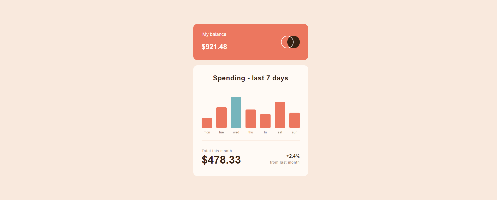

# Expenses chart component

This is a solution to build out this bar chart component and get it looking as close to the design as possible.

The users should be able to:

- View the bar chart and hover over the individual bars to see the correct amounts for each day
- See the current day's bar highlighted in a different colour to the other bars
- See hover states for all interactive elements on the page

## Table of contents

- [Overview](#overview)
  - [Link](#links)
  - [Screenshots](#screenshot)
- [My process](#my-process)
  - [Built with](#built-with)
- [Author](#author)

## Overview

### Link

- URL: [Expenses chart component](https://expense-chart-component.vercel.app/)

### Screenshots

## My process

### Built with

- Semantic HTML5 markup
- CSS custom properties
- Flexbox
- CSS Grid
- [React](https://reactjs.org/) - JS library

## Author

- Website - [Xiaomin Guo](https://min-website-aislandmin.vercel.app/)
